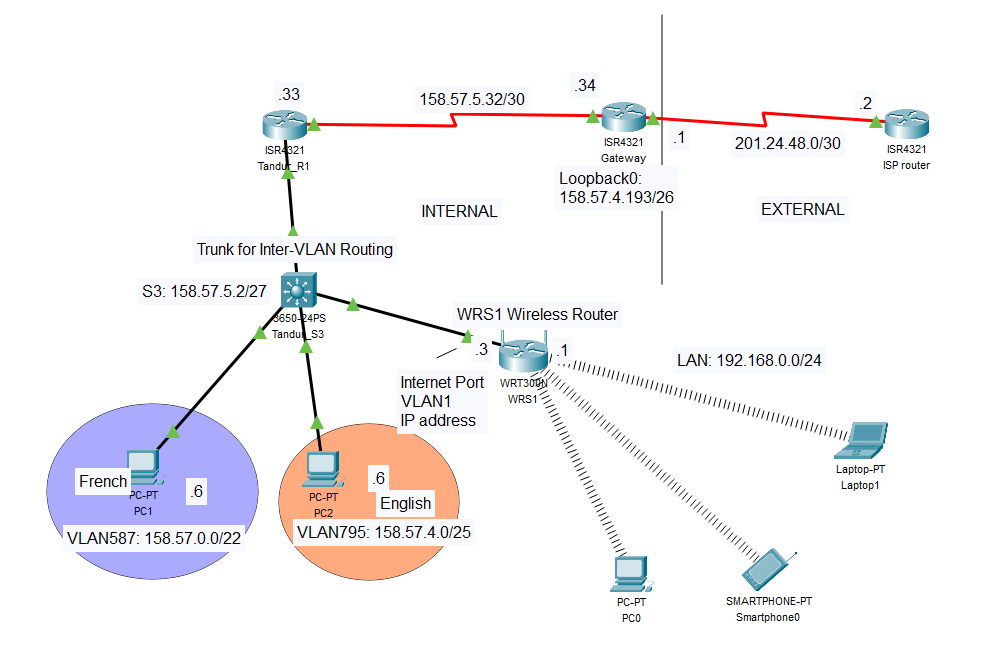

# Scenario 1: RIPv2 and Wireless Router Configuration

## Overview

Scenario 1 designs and constructs a network consisting of three routers and one switch using RIPv2 as the dynamic routing protocol.

## Requirements

- **Connectivity**: All PCs, wireless devices, switches, and routers should be able to successfully ping all other devices in the network and in the ISP. This should be implemented where the only statically installed routes are the static routes on the ISP router and the default route on the gateway router. All other entries in the routing tables should be automatically entered via RIPv2 or exist because the network is directly connected.

## Wireless Requirements for Scenario

- **Wireless Router Configuration**:
    - On WRS1 Wireless Router:
        - Configure the Internet Port with VLAN 1 IP address.
        - Set SSID as W103795587.
        - Enable DHCP to provide addresses for Wireless LAN PCs and Mobile Phone.
        - Allow inbound ping requests.
    - Connect a straight-through UTP cable between Tandur Switch S3 G1/0/1 (port in VLAN1) and the Internet Port (in VLAN1) on the Wireless Router.
    - VLAN 1 will carry wireless traffic.
    - On ISP Router, use `debug ip icmp`.
    - Configure a wireless end device to ping the internet.
    - From the Wireless End Device, ping the internet.