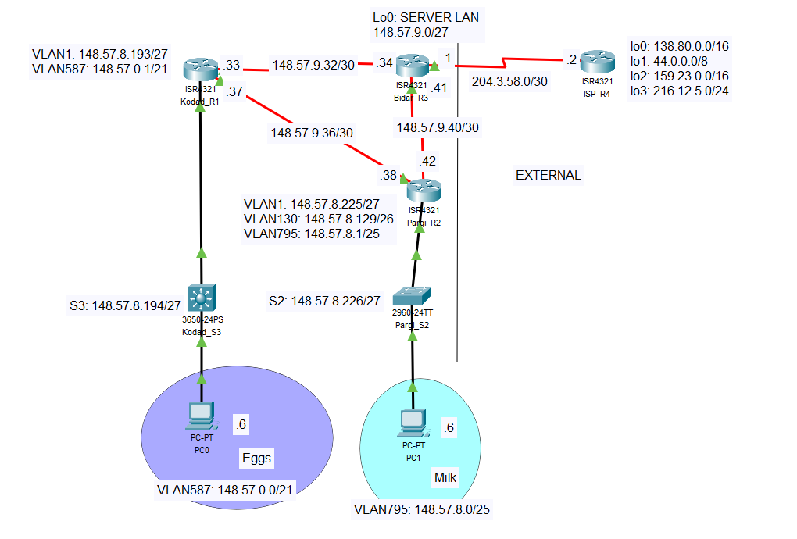

# Scenario 2: RIPv2 and ACL (Extended)

## Overview

Scenario 2 involves designing and constructing a network consisting of four routers and one switch. The network is built to establish an internal network using a Routing Protocol connected to an external network via a public IP address. Access Control Lists (ACLs) are deployed to protect segments of the internal network.

## Access Control List Requirements

Access Control Lists (ACLs) are configured to protect parts of the network. Specifically, ACLs for VLAN587 are implemented as follows:

- PCs in VLAN587 are denied HTTP access to ISP Loopback0 and permit ALL other access to Loopback0 and the Internet.
- PCs in VLAN587 are permitted only HTTP access to ISP Loopback1 and deny ALL other access to Loopback1.
- PCs in VLAN587 are denied all access to ISP Loopback2.
- PCs in VLAN587 are permitted ALL access to the rest of the Internet.
