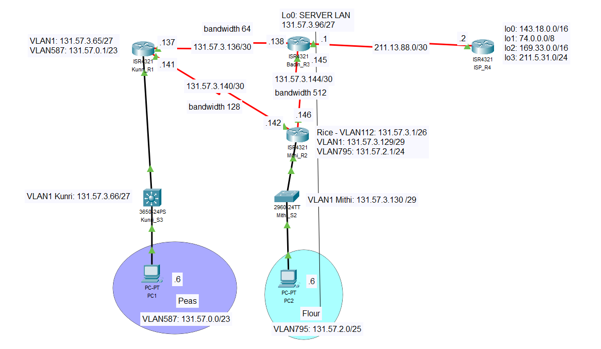

# Scenario 3: EIGRP and ACL (Extended & Standard)

## Overview

Scenario 3 involves designing and constructing a network consisting of four routers and two switches. The network is built to establish an internal network using the Enhanced Interior Gateway Routing Protocol (EIGRP) as the routing protocol. ACLs are deployed to protect segments of the network, and the network is connected to an external network via a public IP address.

## EIGRP Requirements for Scenario

For Scenario 3, the following EIGRP requirements must be met:
- Run EIGRP on all internal corporate routers with autonomous system number 65 (Kunri, Mithi, and Badin).
- Configure bandwidth for the point-to-point links between routers as follows:
    - Badin-Mithi: configure bandwidth 512
    - Badin-Kunri: configure bandwidth 64
    - Kunri-Mithi: configure bandwidth 128
- Advertise all internal network addresses on all internal routers, advertising each subnet individually with an appropriate wildcard mask.
- Advertise the default route installed on the gateway router (Badin).
- Disable broadcasting on internal edge-networks (all interfaces connected to PCs) for all sub-interfaces of g0/0/1 on Kunri and Mithi.

## ACL Requirements for Scenario

The ACL security requirements for Scenario 3 are as follows:

### Generic ACLs
1. PCs in VLAN 587 are permitted HTTP access to ISP Loopback 0 and deny ALL other access to this interface.
2. PCs in VLAN 587 are permitted ALL access to the Internet (all other servers).

### Telnet ACLs
1. ONLY PCs in VLAN 587 are permitted TELNET access to Kunri Router.
2. ONLY PCs in VLAN 587 are denied TELNET access to Badin Router.
