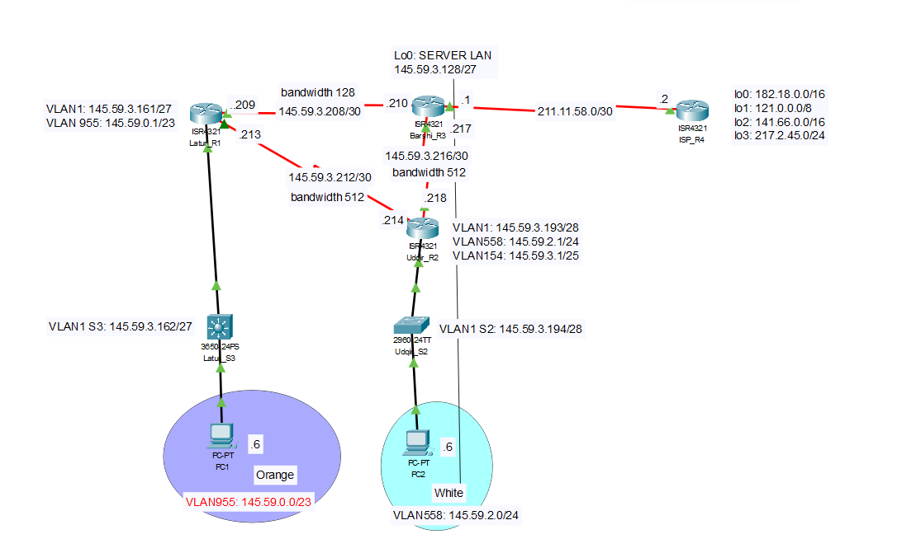

# Scenario 4: OSPF and ACL (Extended & Standard)

## Overview

Scenario 4 involves designing and constructing a network consisting of four routers and two switches. The network is built to establish an internal network using the Open Shortest Path First (OSPF) as the routing protocol. ACLs are deployed to protect segments of the network, and the network is connected to an external network via a public IP address.

## OSPF Requirements for Scenario

For Scenario 4, the following OSPF requirements must be met:
- Run OSPF on all internal corporate routers.
- Configure bandwidth for the point-to-point links between routers as follows:
    - Barshi-Udgir: configure bandwidth 512
    - Barshi-Latur: configure bandwidth 128
    - Latur-Udgir: configure bandwidth 512
- Advertise all internal network addresses on all internal routers, advertising each subnet individually with an appropriate wildcard mask.
- Advertise the default route installed on the gateway router (Barshi).
- Disable broadcasting on internal edge-networks (all interfaces connected to PCs) for all sub-interfaces of g0/0/1 on Latur and Udgir.

## ACL Requirements for Scenario

The ACL security requirements for Scenario 4 are as follows:

### Generic ACLs
1. PCs in VLAN 955 are permitted HTTP access to ISP Loopback 0 and deny ALL other access to this interface.
2. PCs in VLAN 955 are permitted ALL access to the Internet (all other servers).
3. PCs in VLAN 558 are denied PING access to PCs in VLAN 955.
4. PCs in VLAN 558 are permitted ALL access to the Internet.

### Telnet ACLs
1. ONLY PCs in VLAN 955 are permitted TELNET access to Latur Router.
2. ONLY PCs in VLAN 955 are denied TELNET access to Barshi Router.

