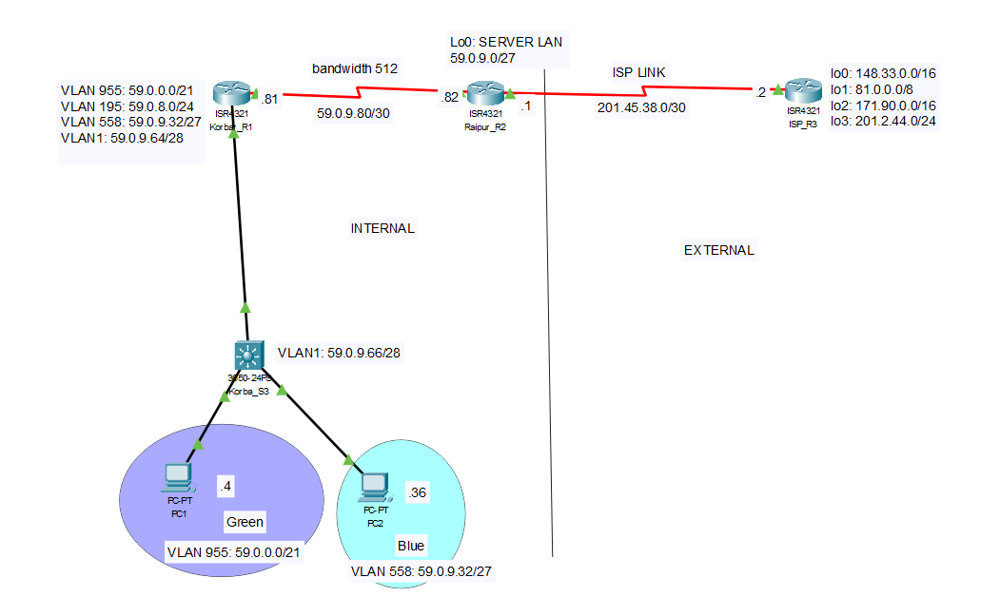

# Scenario 5: OSPF, DHCP, NAT, ACL (Extended & Standard)

## Overview

Scenario 5 involves designing and constructing a network consisting of three routers and one switch. The network is built to establish an internal network using the Open Shortest Path First (OSPF) as the routing protocol. DHCP is deployed for automatic network configuration of internal PCs, and NAT is implemented for sharing a single public IP address with devices inside the corporate network. ACLs are also deployed to protect segments of the network.

## OSPF Requirements for Scenario

For Scenario 5, OSPF must be configured on the internal routers as follows:
- Run OSPF on all internal corporate routers.
- Configure the bandwidth for the point-to-point links between routers as follows:
    - Raipur-Korba: configure bandwidth 512.
- Advertise all internal network addresses on all internal routers, advertising each subnet individually with an appropriate wildcard mask.
- Advertise the default route installed on the gateway router (Raipur).
- Disable broadcasting on internal edge-networks (all interfaces connected to PCs) for all sub-interfaces of g0/0/1 on Korba.

## DHCP Requirements for Scenario

For Scenario 5, DHCP must be configured as follows:
- Run DHCP to provide IP addresses for all devices on VLAN955 and VLAN558 (two DHCP pools).
- The DHCP service should be run on Korba.
- The DHCP pools should cover the range of IP addresses for those two VLANs.
- Exclude the first three IP addresses from being allocated by DHCP.

## NAT Requirements for Scenario

For Scenario 5, NAT must be configured as follows:
- Use the NAT Public IP Address Pool provided by the ISP of 141.12.2.0/24.
- Divide this pool into 3 sub-pools (do not use VLSM).
- Allocate these three sub-pools to VLAN1, VLAN955, and VLAN558.
- Remove all static routes on the ISP Router that refer to the Corporate Network Address and replace it with a static route that maps only to the NAT Public IP Address Pool.

## ACL Requirements for Scenario

The ACL security requirements for Scenario 5 are as follows:

### Generic ACLs
1. PCs in VLAN 955 are permitted HTTP access to ISP Loopback 0 and deny ALL other access to this interface.
2. PCs in VLAN 955 are denied PING requests to PCs in VLAN 558.
3. PCs in VLAN 955 are permitted PING replies to PCs in VLAN 558.
4. PCs in VLAN 955 are permitted ALL access to the Internet.
5. ALL access to the Internet is permitted to all other servers.

### Telnet ACLs
1. ONLY PCs in VLAN 955 are permitted TELNET access to Korba Router.
2. ONLY PCs in VLAN 955 are denied TELNET access to Raipur Router.
