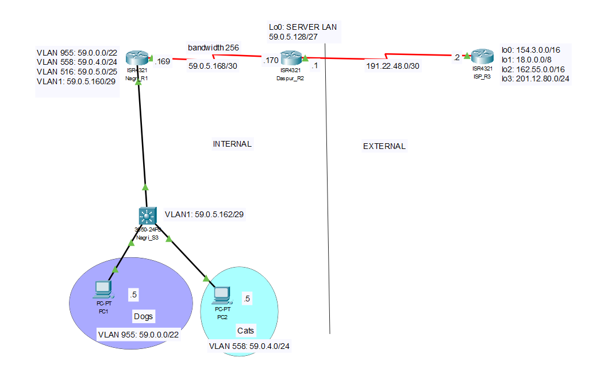

# Scenario 6: OSPF, DHCP, NAT, ACL (Extended & Standard), PPP and CHAP

## Overview

Scenario 6 involves designing and constructing a network consisting of three routers and one switch. The network is built to establish an internal network using the Open Shortest Path First (OSPF) as the routing protocol. DHCP is deployed for automatic network configuration of internal devices, and NAT is implemented for sharing public IP addresses. ACLs are also deployed to protect segments of the network. Additionally, PPP with CHAP authentication is used to manage the serial connection between the gateway router and the ISP.

## OSPF Requirements for Scenario

For Scenario 6, OSPF must be configured on the internal routers as follows:
- Run OSPF on all internal corporate routers.
- Configure the bandwidth for the point-to-point links between routers as follows:
    - Daspur-Nagri: configure bandwidth 256.
- Advertise all internal network addresses on all internal routers, advertising each subnet individually with an appropriate wildcard mask.
- Advertise the default route installed on the gateway router (Daspur).
- Disable broadcasting on internal edge-networks (all interfaces connected to PCs) for all sub-interfaces of g0/0/1 on Nagri.

## DHCP Requirements for Scenario

For Scenario 6, DHCP must be configured as follows:
- Run DHCP to provide IP addresses for all devices on VLAN955 and VLAN558 (two DHCP pools).
- The DHCP service should be run on Daspur (not Nagri).
- The DHCP pools should cover the range of IP addresses for those two VLANs.
- Exclude the first four IP addresses from being allocated by DHCP.
- Configure the DHCP helper IP address on Nagri using the `ip helper-address` command.

## NAT Requirements for Scenario

For Scenario 6, NAT must be configured as follows:
- Use the NAT Public IP Address Pool provided by the ISP of **135.12.64.0/25**.
- Divide this pool into 3 sub-pools (do not use VLSM).
- Allocate these three sub-pools to VLAN1, VLAN955, and VLAN558.
- Use DHCP overloading when allocating the sub-pools.

## ACL Requirements for Scenario

The ACL security requirements for Scenario 6 are as follows:

### Generic ACLs
1. PCs in VLAN 955 are permitted HTTP access to ISP Loopback 0 and deny ALL other access to this interface.
2. PCs in VLAN 955 are denied PING requests to PCs in VLAN 558.
3. PCs in VLAN 955 are permitted PING replies to PCs in VLAN 558.
4. PCs in VLAN 955 are permitted ALL access to the Internet.
5. PCs in VLAN 558 are denied ALL access to the Database Server LAN.
6. PCs in VLAN 558 are permitted ALL access to the Internet.

### Telnet ACLs
1. ONLY PCs in VLAN 955 are permitted TELNET access to Nagri Router.
2. ONLY PCs in VLAN 955 are denied TELNET access to Daspur Router.

## PPP and CHAP Requirements for Scenario

For Scenario 6, PPP with CHAP must be configured as follows:
- Configure PPP with CHAP to manage the Serial Point-to-Point Link between the Nagri and Daspur routers.
- Configure CHAP using the password `cisco`.

